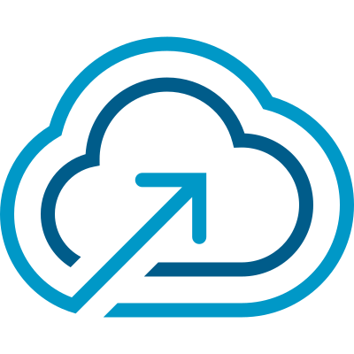

<!--
Copyright 2023-2024 Broadcom. All rights reserved.
SPDX-License-Identifier: BSD-2
-->

<!-- markdownlint-disable first-line-h1 no-inline-html -->



# Building the Terraform Provider for VMware Cloud Foundation

The instructions outlined below are specific to macOS and Linux only.

If you wish to work on the provider, you'll first need [Go][golang-install] installed on your
machine. Check the [requirements][requirements] before proceeding.

1. Clone the repository to: `$GOPATH/src/github.com/vmware/terraform-provider-vcf`

   ```sh
   mkdir -p $GOPATH/src/github.com/vmware
   cd $GOPATH/src/github.com/vmware
   git clone git@github.com:vmware/terraform-provider-vcf.git
   ```

2. Enter the provider directory to build the provider.

   ```sh
   cd $GOPATH/src/github.com/vmware/terraform-provider-vcf
   go get
   go build -o terraform-provider-vcf
   ```

3. Add the following to your `~/.terraformrc`:

   ```hcl
   provider_installation {
     dev_overrides {
       "vmware/vcf" = "/Users/rainpole/go/bin"
     }

     direct {}
   }
   ```

    Where `/Users/rainpole/go/bin` is your `GOPATH/bin` path.

4. Run `go install` to install the development binary.

[golang-install]: https://golang.org/doc/install
[requirements]: https://github.com/vmware/terraform-provider-vcf#requirements
